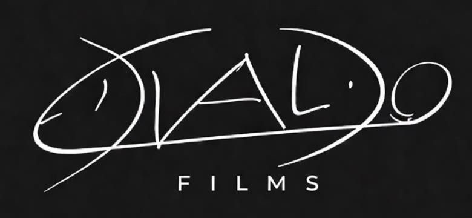

<p align="center">
  
</p>

# Edvaldo Films | Portfólio Audiovisual

Portfólio interativo de Edvaldo Films, filmmaker de João Pessoa/PB, com trabalhos de Reels, comerciais, lifestyle e captação aérea.

[Acessar portfólio](https://wendell-ramos.github.io/edvaldo-films-portfolio/) · [Instagram](https://www.instagram.com/edvaldofilms/) · [YouTube](https://www.youtube.com/@edvaldocordeiro11)

## Sobre o projeto

Este repositório contém o portfólio audiovisual de Edvaldo Films, desenvolvido como uma experiência imersiva e orientada a vídeo.

Em vez de uma apresentação estática, o visitante pode assistir a trechos dos trabalhos, filtrar projetos por categoria, abrir cases completos e conhecer as etapas do processo de produção.

O projeto apresenta trabalhos voltados para redes sociais, marcas, produtos, profissionais e negócios locais, reunindo vídeos verticais, comerciais, produções lifestyle e imagens aéreas.

> **Criar / Registrar / Marcar**

## Funcionalidades

- Abertura cinematográfica com vídeo em tela cheia
- Identidade visual personalizada da Edvaldo Films
- Portfólio com filtros para Reels, comerciais e lifestyle
- Cards em vídeo com capas selecionadas para cada produção
- Cases detalhados com vídeo, descrição e objetivo do projeto
- Área dedicada a trabalhos com drone
- Comparação visual entre bastidor e resultado final
- Galeria de imagens para conteúdo corporativo, lifestyle e cotidiano
- Apresentação dos serviços oferecidos
- Fluxo de produção dividido em briefing, roteiro, gravação e entrega
- Animações, transições e efeitos interativos durante a navegação
- Controles para pausar movimentos da interface
- Suporte a dispositivos com preferência por movimento reduzido
- Contato direto pelo Instagram e pelo canal do YouTube
- Layout responsivo para desktop, notebook, tablet e celular

## Projetos apresentados

### Comunicação corporativa

Vídeo profissional criado para apresentar ideias com clareza, fortalecer a credibilidade e aproximar a marca do público.

**Formato:** Reel corporativo com captação dirigida, edição vertical e legendas para redes sociais.

### Comercial automotivo

Produção para uma empresa de estética automotiva, destacando acabamento, transformação e qualidade do serviço.

**Formato:** Vídeo comercial pensado para valorizar o trabalho, fortalecer a marca e atrair novos clientes.

### Publi Monster | Setup gamer

Publicação de produto ambientada em um setup gamer, explorando iluminação, detalhes e a identidade visual da marca.

**Formato:** Peça vertical com linguagem lifestyle para redes sociais, campanhas e divulgação de produto.

### Autoridade para especialistas

Reel profissional com fala direta, cenário planejado e enquadramento limpo para transmitir conhecimento.

**Formato:** Conteúdo vertical com legendas, desenvolvido para construir autoridade e presença digital.

## Captação aérea

### Horizonte urbano

Movimentos amplos sobre litoral, arquitetura e espaços urbanos para apresentar destinos, eventos e campanhas com maior escala visual.

### Território e propriedade

Percurso aéreo entre estrada, área verde e propriedade, conectando localização, entorno e estrutura para projetos institucionais.

## Serviços apresentados

- **Reels:** conteúdos verticais com gancho, ritmo de rede social e versões prontas para publicação
- **Comerciais:** vídeos para marcas, produtos e negócios com direção visual e foco em conversão
- **Lifestyle:** filmes com movimento, naturalidade e estética de campanha
- **Drone:** imagens aéreas em 4K para apresentar localização, escala e atmosfera

## Processo de produção

1. **Briefing:** definição do objetivo, público, formato e canal principal
2. **Roteiro visual:** planejamento de ganchos, cenas, referências, locação e ritmo
3. **Gravação:** direção no set e captação dos takes principais e complementares
4. **Entrega:** edição final, versões verticais, ajustes e arquivos prontos para publicação

## Tecnologias utilizadas

| Tecnologia | Aplicação |
| --- | --- |
| React | Componentes, estados, filtros, modais e interações |
| JavaScript | Comportamentos da interface e controle dos vídeos |
| CSS3 | Identidade visual, animações e responsividade |
| Vite | Ambiente de desenvolvimento e geração do build |
| Lucide React | Ícones da interface |
| Git | Versionamento do projeto |
| GitHub Actions | Build e publicação automatizados |
| GitHub Pages | Hospedagem do portfólio |

## Estrutura

```text
edvaldo-films-portfolio/
├── .github/
│   └── workflows/
│       └── deploy-pages.yml
├── public/
│   └── media/
│       ├── edvaldo-films-logo.png
│       ├── edvaldo-films-brand.jpg
│       ├── vídeos otimizados
│       └── capas e imagens
├── src/
│   ├── main.jsx
│   └── styles.css
├── index.html
├── package.json
├── vite.config.js
└── README.md
```

Os arquivos originais e materiais de análise permanecem fora da publicação. Somente as mídias otimizadas utilizadas pelo site são enviadas para `public/media`.

## Responsividade

A interface foi adaptada para diferentes dimensões:

- Em desktops, os vídeos e projetos aproveitam áreas amplas e composições cinematográficas
- Em notebooks e tablets, as grades são reorganizadas para preservar leitura e proporção
- Em celulares, o conteúdo passa para uma coluna e os controles ocupam toda a largura disponível
- Os cases ajustam o vídeo e o texto de forma independente para evitar rolagens ou cortes desnecessários
- Tipografia, navegação, animações e mídia se adaptam sem perder a identidade visual

## Executar localmente

```bash
npm install
npm run dev
```

Para gerar e conferir a versão de produção:

```bash
npm run build
npm run preview
```

## Publicação

Cada envio para a branch `main` inicia automaticamente o workflow de publicação no GitHub Pages.

O processo instala as dependências, gera o build do Vite e publica a pasta `dist` no endereço oficial do projeto.

## Autoria

### Edvaldo Films

Filmmaker de João Pessoa/PB responsável pelos conteúdos audiovisuais e pela identidade apresentada no portfólio.

[Instagram](https://www.instagram.com/edvaldofilms/) · [YouTube](https://www.youtube.com/@edvaldocordeiro11)

### Wendell Ramos

Responsável pelo design, desenvolvimento e publicação do portfólio.

[Portfólio](https://wendell-ramos.github.io/portfolio-wendell-ramos/) · [GitHub](https://github.com/wendell-ramos)

Desenvolvido por **Wendell Ramos** para **Edvaldo Films**.
